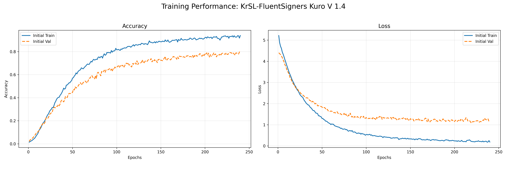
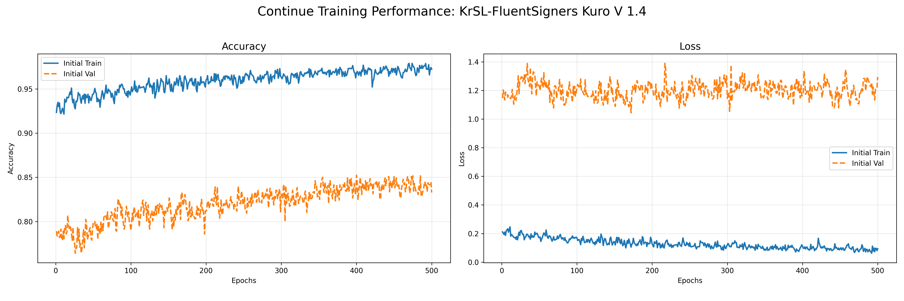
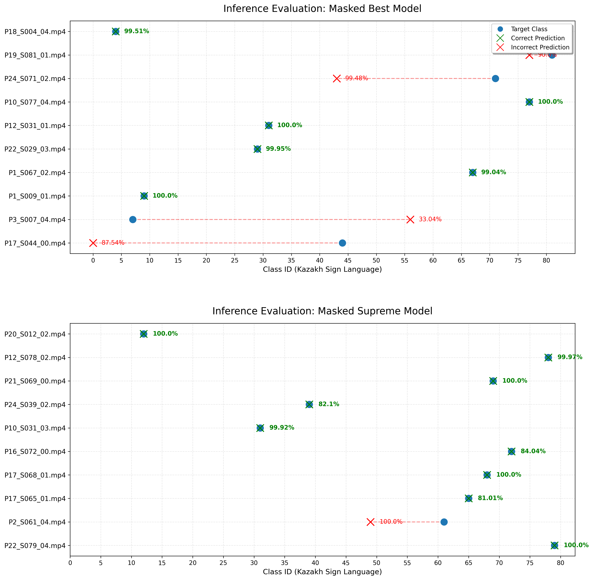

# My University Diploma Research Project for Accessible Kazakh Dialect of Sign Language Recognition


---
## Table of contents
- [Prologue](#prologue)
- [Mission](#mission)
  - [Research Focus](#research-focus)
- [Specifications](#specifications)
  - [Project](#project)
  - [Prerequisites](#prerequisites)
  - [Installation](#installation)
  - [Device Specifications](#device-specifications)
  - [Dataset](#dataset)
  - [Project Requirements](#project-requirements)
- [Project Overview](#project-overview)
  - [Key Achievements](#key-achievements)
- [Technical Specifications](#technical-specifications)
  - [Model: sign_lstm_masked_supreme_best.keras](#model-sign_lstm_masked_supreme_bestkeras)
  - [System Pipeline](#system-pipeline)
  - [FluentSigners-50 Dataset Usage](#fluentsigners-50-dataset-usage)
- [Project Architecture](#project-architecture)
  - [Feature Extraction (1,692-Dimensional Vector)](#feature-extraction-1692-dimensional-vector)
  - [Training Details](#training-details)
  - [Performance Metrics Summary](#performance-metrics-summary)
- [Testing](#testing)
  - [Video test](#video-test)
  - [Camera testing (in development)](#camera-testing-in-development)
- [Model Performance](#model-performance)
  - [Validation Results](#validation-results)
  - [Hardware Performance](#hardware-performance)
  - [Example Test Results](#example-test-results)
- [Key Innovations](#key-innovations)
- [Use Cases](#use-cases)
- [Development Status](#development-status)
  - [Completed Features](#completed-features)
  - [In Development](#in-development)
  - [Future Improvements (are not promised)](#future-improvements-are-not-promised)
- [Performance Analysis](#performance-analysis)
  - [Accuracy by Sign Category](#accuracy-by-sign-category)
  - [Inference Performance](#inference-performance)
- [Known Limitations](#known-limitations)
- [Usage Notes](#usage-notes)
- [Support & Questions](#support--questions)
- [Project Statistics](#project-statistics)
- [Key Takeaways](#key-takeaways)
- [Conclusion](#conclusion)
### **To see the results of testing please check the videos at: [etc/video](etc/video), [etc/img](etc/img) and [etc/gif](etc/gif)**  
### model accuracy result example:

### for latest model check the [releases](https://github.com/K0d0ku/Uni_diploma_project_ML/releases)

## Prologue
This repository is designated for my university diploma research project focused on developing an accessible Kazakh Sign Language Recognition system model. In this repository, I document the entire research and development process, including data preparation, model training, evaluation, and deployment considerations. The project is designed to be open-source and free to use, with the goal of enabling real-world applications that facilitate communication for deaf individuals using Kazakh Sign Language.


## Mission
> **"Help for those in need should not be limited or paid."**

This project develops a deployment-ready Kazakh Sign Language Recognition system to facilitate real-time communication between deaf people using Kazakh Sign Language (KrSL) and others. By combining cutting-edge deep learning with efficient CPU-based inference, we create accessible technology that works on consumer hardware with no licensing barriers.

This project embodies a core principle: **technology for accessibility should never have barriers.**

Too often, assistive technology comes with:
- Expensive licensing fees
- Complex hardware requirements
- Proprietary formats
- Limited customization options

**my approach:**
- Open-source and free to use
- Works on consumer computers
- No licensing restrictions
- Fully customizable for future needs
- Community-driven improvements

By proving that quality sign language recognition works on basic hardware, we hope to inspire similar accessible technology initiatives worldwide.

### Research Focus
- Researching methods to ease communication between deaf communities and hearing populations
- Developing deployment-ready ML models with limited computational resources
- Creating accessible technology with no usage restrictions or licensing fees
- Proving that high-quality sign language recognition is achievable on consumer hardware


---

## Specifications

### Project
- **License:** MIT
- **Institution:** University Diploma Program
- **Diploma program:** Bachelor of Science in Computer Science
- **University:** [Satbayev University](https://satbayev.university/en) `(Kazakhstan, Almaty)`

### Prerequisites
- Python 3.11+
- 2GB+ RAM minimum (works on 8GB)
- CPU with SSE support (all modern CPUs have this)
- Webcam or MP4 video file (optional)

### Installation

```bash
# Clone repository
git clone https://github.com/YOUR_USERNAME/KrSL_FluenSigners-50_Kuro.git
cd KrSL_FluenSigners-50_Kuro

# Create virtual environment
python -m venv venv
venv\Scripts\activate  # Windows
# source venv/bin/activate  # Linux/Mac

# Install dependencies
pip install -r requirements.txt

# Download pre-trained model (if not included)
# Place sign_lstm_masked_supreme_best.keras in models/
```

### Device Specifications
The project is made on a low-end acer laptop with the following hardware specifications:

| Component | Specification Details                |
| :--- |:-------------------------------------|
| **Processor (CPU)** | Intel Core i5-6300U                  |
| **Memory (RAM)** | 8GB (4GB Soldered + 4GB DDR$ SODimm) |
| **Internal Storage** | 512GB M.2 SSD                        |
| **External Storage** | 1TB External M.2 SSD                 |
| **Graphics (GPU)** | Intel HD Graphics 520 (128MB VRAM)   |
the listed hardware specifications makes the project very challenging with limited hardware computational power 

### Dataset
Dataset is from [KRSLR FluentSigners-50](https://krslproject.github.io/FluentSigners-50/) by the K-SLARS team.  

---
## FluentSigners-50: a signer independent benchmark dataset for Sign Language Processing,
#### Medet Mukushev, Aidyn Ubingazhibov, Aigerim Kydyrbekova, Alfarabi Imashev, Vadim Kimmelman, Anara Sandygulova Nazarbayev University, University of Bergen
### Citation (K-SLARS team)
Mukushev M, Ubingazhibov A, Kydyrbekova A, Imashev A, Kimmelman V, et al. (2022) FluentSigners-50: A signer independent benchmark dataset for sign language processing. PLOS ONE 17(9): e0273649. https://doi.org/10.1371/journal.pone.0273649
### Acknowledgment (K-SLARS team)
This work was supported by the Nazarbayev University Faculty Development Competitive Research Grant Program 2019-2021 "Kazakh Sign Language Automatic Recognition System (K-SLARS)". Award number is 110119FD4545".  

---
Since there are not a lot of *openly available* datasets for Kazakh Sign Language, i made my choice on FluentSigners-50 specifically, because its not only openly available but also the size of the dataset is perfect,   
it is made including all known Inclusiv categories such as: Deaf, Hard of hearing, Hearing Coda and Hearing Soda, form all regions of Kazakhstan, of most ethnicities and age ranges:

Even the size of dataset is perfect not too big or not too small, the dataset provides raw video files of annotations.  
As the name suggests the dataset is made with 50 contributors, whom were communicating via the sign language very long or even since birth.  
The dataset Contains **173** annotations, which are the direct translations of the gesture movement sequence, and is structured as such, so each folder is an annotation.  
Each folder contains **250 video** samples per annotation for all annotations from **50 signers** with **5 versions** per signer, roughly containing 43250 videos overall.  

| Annotations              |     Samples      |  Signers   | Versions (per signer) | Amount overall |
|:-------------------------|:----------------:|:----------:|:-----------------:|:--------------:|
| 173 annotation / classes | 250 per annotation | 50 signers |         5         |  43250 videos  |
BUT , due to my hardware limitations i could only download and use only a quarter (25%) of the dataset, which is still a very good size for training a model.

| Annotations             |      Samples       |  Signers   | Versions (per signer) | Amount overall |
|:------------------------|:------------------:|:----------:|:-----------------:|:--------------:|
| 80 annotation / classes | 125 per annotation | 25 signers |         5         |  10000 videos  |

The project annotations can be seen at: 
- [Kazakh](data/annotations/kazakh.json)
- [Gloss](data/annotations/gloss.json)
- [Russian](data/annotations/russian.json)

And the original annotations are at:
- [Gloss](https://raw.githubusercontent.com/krslproject/fluentsigners-50/main/gloss_annotation.csv)
- [Russian](https://raw.githubusercontent.com/krslproject/fluentsigners-50/main/russian_translation.csv)

### Project Requirements

The project is written in Python 3.11 and uses TensorFlow/Keras for deep learning, MediaPipe for landmark extraction, and OpenCV for video processing and visualization.
The requirements are listed in [requirements.txt](requirements.txt) and include various packages, with the core dependencies being:
- TensorFlow 2.15.0
- MediaPipe 0.10.9
- OpenCV 4.13.0
- NumPy 1.26.4
- Pandas 3.0.1
- keras 2.15.0  
- Matplotlib 3.10.8  

and is made in:
- Pycharm IDE (2023.1, 2026.1(community ed.))
---

## Project Overview
**KrSL FluentSigners-50** is a masked LSTM-based Kazakh Sign Language gesture recognition system trained as part of university diploma research. The model achieves **85% accuracy** for recognizing 80 Kazakh sign language categories from the FluentSigners-50 dataset, optimized for web and server-side deployment with real-time CPU inference.  

Due to the computational limitation i had to rely and use on a lot of known modern methods of training the model for this specific task, as the model has to **visually analyze a video or live camera** to detect the sequence of gestures, and accurately predict / detect that following sequence with most accuracy and possibly in real time,   
so i chose to train a BiLstm neural network. As you (or others) might surf thru the code, you can see the various stages of me making improvements of experimenting with the model.  
Because it is my first time actually making a serious model on the subject of machine learning and all of my previous experiences in machine learning field include Simple image models or already premade datasets, it was very difficult for me to make what we have here,
the current latest and stable version of the model is [V1.4 sign_lstm_masked_supreme_best](https://github.com/K0d0ku/Uni_diploma_project_ML/releases/tag/v1.4) `(check releases)`, with the model reachin accuracy of **85%** and working perfectly in real time even at the current device specifications.

### Key Achievements
| Aspect | Details                                        |
|:---|:-----------------------------------------------|
| **Accuracy** | 85% on actual video and camera test            |
| **Model Size** | 15.6 Million parameters                        |
| **Training Epochs** | 240 (initial) + 500 (continuation) = 740 total |
| **Training Method** | Grokking (knowledge absorption technique)      |
| **Architecture** | Masked Bidirectional LSTM with attention       |
| **Inference Speed** | Real-time on CPU                               |
| **Deployment** | Web and Server-side ready                      |
| **Hardware Support** | Works on basic consumer hardware               |
| **Dataset Used** | FluentSigners-50 (25% of original)             |
| **Sign Classes** | 80 Kazakh gesture annotations                  |

---

## Technical Specifications

### Model: `sign_lstm_masked_supreme_best.keras`

**Architecture Overview:**
```
Input Layer (Batch, 30 frames, 1692 features)
    ↓
MediaPipe Feature Processing (Pose + Face + Hands)
    ↓
Bidirectional Masked LSTM Layers
    ├─ Forward LSTM cells
    └─ Backward LSTM cells
    ↓
Attention Mechanism
    ├─ Computes frame importance
    └─ Focuses on discriminative gestures
    ↓
Dense Classification Layers (80 outputs)
    ↓
Softmax Output (Gesture probability distribution)
```

**Key Design Decisions:**

1. **Masking Mechanism**
   - Handles variable-length video sequences
   - Prevents models from learning on padded frames
   - Improves robustness to incomplete gestures

2. **Bidirectional Processing**
   - Processes sequences forward and backward
   - Captures temporal context from both directions
   - Better understanding of gesture flow

3. **Grokking Training Method**
   - Extended training beyond early convergence
   - Model eventually "grok" patterns after memorization phase
   - 740 total epochs for deep learning
   - Initial 240 epochs for pattern discovery
   - Continued 500 epochs for refinement

4. **MediaPipe Landmarks (1,692-D vectors)**
   - 33 pose keypoints (4D each: x, y, z, visibility)
   - 478 face landmarks (3D: x, y, z) 
   - 21 left-hand keypoints (3D)
   - 21 right-hand keypoints (3D)
   - Normalized and standardized before model input
   - 

### System Pipeline

```
┌─────────────────────────────────────────────────────────┐
│           INPUT: Video Stream or Webcam Feed            │
│              (MP4 file or live camera)                  │
└────────────────────┬────────────────────────────────────┘
                     │
                     ▼
┌─────────────────────────────────────────────────────────┐
│      Frame Extraction & Sampling (30 fps target)        │
│    Creates consistent-length sequence (30 frames)       │
└────────────────────┬────────────────────────────────────┘
                     │
                     ▼
┌─────────────────────────────────────────────────────────┐
│    MediaPipe Holistic Landmark Detection                │
│  Extracts pose, face, hand keypoints (1,692-D vector)   │
│              per frame per person                       │
└────────────────────┬────────────────────────────────────┘
                     │
                     ▼
┌─────────────────────────────────────────────────────────┐
│   Feature Normalization & Standardization               │
│   Frame-wise mean subtraction + Z-score normalization   │
│     Using pre-computed mean/std from training data      │
└────────────────────┬────────────────────────────────────┘
                     │
                     ▼
┌─────────────────────────────────────────────────────────┐
│   Create Sequence Mask for Variable Lengths             │
│   Mask indicates valid (real) vs padded (empty) frames  │
└──────────────────────┬──────────────────────────────────┘
                     │
                     ▼
┌─────────────────────────────────────────────────────────┐
│   LSTM Model Inference (sign_lstm_masked_supreme...)    │
│   Input: (1, 30, 1692) sequence + (1, 30, 1) mask       │
│   Process: Bidirectional LSTM + Attention Mechanism     │
└────────────────────┬────────────────────────────────────┘
                     │
                     ▼
┌─────────────────────────────────────────────────────────┐
│    Dense Classification Layers (80 outputs)             │
│    80-class softmax probability distribution            │
└────────────────────┬────────────────────────────────────┘
                     │
                     ▼
┌─────────────────────────────────────────────────────────┐
│   OUTPUT: Predicted Gesture Class + Confidence          │
│  (Sign ID + Kazakh Translation + Probability %)         │
│     Display on video with recognized annotation         │
└─────────────────────────────────────────────────────────┘
```

### FluentSigners-50 Dataset Usage
The annotations can be seen at: 
- [Kazakh](data/annotations/kazakh.json)
- [Gloss](data/annotations/gloss.json)
- [Russian](data/annotations/russian.json)

| Metric | Original Dataset |         Used in Project         |
|:---|:----------------:|:-------------------------------:|
| **Total Annotations** |       173        |           80 (46.24%)           |
| **Samples per Annotation** |       250        |            125 (50%)            |
| **Total Videos** |     ~43,250      |        ~10,000 (23.12%)         |
| **Unique Signers** |        50        |               25                |
| **Coverage** |   Full dataset   | Representative subset (quarter) |


---


## Project Architecture


### Feature Extraction (1,692-Dimensional Vector)

```
MediaPipe Holistic Output
├─ Pose (33 points)
│  └─ Each: x, y, z coordinates + visibility confidence
│     └─ 33 × 4 = 132-D
│
├─ Face (478 points)
│  └─ Each: x, y, z coordinates (no visibility per-point)
│     └─ 478 × 3 = 1,434-D
│
├─ Left Hand (21 points)
│  └─ Each: x, y, z coordinates
│     └─ 21 × 3 = 63-D
│
└─ Right Hand (21 points)
   └─ Each: x, y, z coordinates
      └─ 21 × 3 = 63-D

Total Dimensionality: 132 + 1434 + 63 + 63 = 1,692-D per frame
```
The system utilizes a multi-stage pipeline to transform raw .mp4 video files into structured numerical arrays (.npy). This ensures that the model receives consistent, normalized data regardless of the original video length or framerate.

| File                                                          | Responsibility                                                        | Path                                    |
|:--------------------------------------------------------------|:----------------------------------------------------------------------|:----------------------------------------|
| [mdeiapipe_utils.py](src/utils/mediapipe_utils.py)            | Low-level landmark extraction using MediaPipe Holistic.               | src/utils/mediapipe_utils.py            |
| [extract_dataset.py](src/preprocessing/extract_landmarks.py)  | High-level dataset processing, sequence padding, and I/O management.  | src/preprocessing/extract_landmarks.py  |

1. Landmark Extraction (mediapipe_utils.py)  
This module initializes the MediaPipe Holistic model and flattens coordinate data into a single feature vector.
```python
def extract_landmarks(results):
    # Extracts Pose (132), Face (1434), Left Hand (63), and Right Hand (63)
    # Total: 1,692 features per frame
    
    pose = np.array([[lm.x, lm.y, lm.z, lm.visibility] for lm in results.pose_landmarks.landmark]).flatten() if results.pose_landmarks else np.zeros(132)
    face = np.array([[lm.x, lm.y, lm.z] for lm in results.face_landmarks.landmark]).flatten() if results.face_landmarks else np.zeros(1434)
    lh = np.array([[lm.x, lm.y, lm.z] for lm in results.left_hand_landmarks.landmark]).flatten() if results.left_hand_landmarks else np.zeros(63)
    rh = np.array([[lm.x, lm.y, lm.z] for lm in results.right_hand_landmarks.landmark]).flatten() if results.right_hand_landmarks else np.zeros(63)

    return np.concatenate([pose, face, lh, rh]).astype(np.float32)
```
`Note on Implementation: In cases where landmarks are not detected, the system defaults to "Zero Mapping." While this maintains vector dimensionality, it is noted as a limitation in the current pipeline version under low-light or occluded conditions.`

2. Dataset Processing (extract_landmarks.py)  
To prepare data for the BiLSTM model, the extraction script performs Temporal Standardization. Every video is converted into a fixed-length sequence of 30 frames.  
- Frame Skipping: To handle high-FPS video on limited hardware, every _N_ - th frame is processed (default _N_=2).
- Sequence Normalization:
- - Short Videos: Padded with zero-arrays at the end to reach 30 frames.
- - Long Videos: Downsampled using linear interpolation to select 30 representative frames.
- Two-Pass Extraction Logic: To ensure balanced classes, the script first attempts to extract 80 samples per class. If the initial batch fails (due to detection errors), it triggers a fallback pass to process all available videos in the directory.

```python
if len(sequence) < TARGET_LENGTH:
    # Zero-padding for short sequences
    padding = np.zeros((TARGET_LENGTH - len(sequence), EXPECTED_SIZE))
    sequence = np.vstack([sequence, padding])
elif len(sequence) > TARGET_LENGTH:
    # Linear downsampling for long sequences
    indices = np.linspace(0, len(sequence) - 1, TARGET_LENGTH, dtype=int)
    sequence = sequence[indices]
```

#### Data Flow Visualization
```
    A[Raw Video .mp4] --> B[OpenCV Frame Capture]
    B --> C[MediaPipe Holistic]
    C --> D[1,692-D Vector Extraction]
    D --> E{Sequence Length?}
    E -- < 30 --> F[Zero Padding]
    E -- > 30 --> G[Linear Sampling]
    F --> H[Final .npy Array]
    G --> H
```
This structure allows for a modular dataset. By saving landmarks as independent .npy files, the training-test split can be re-shuffled without re-running the heavy MediaPipe extraction process.

### Training Details
The core of the system is a Deep Bidirectional LSTM (BiLSTM) network designed to process temporal sequences of skeletal landmarks. With over 15.6 million parameters, the model is deep enough to capture the nuances of Kazakh Sign Language (KrSL) while maintaining real-time inference speeds on standard CPUs.

#### The "Masked" Architecture
To address the "zero-mapping" issue in the dataset (where missing landmarks were replaced with zeros), a custom Multiply Masking layer was implemented. This ensures that the LSTM ignores padded or missing data points during the forward pass, focusing only on valid gesture information.  

#### Technical Implementation
```python
# Defining dual inputs
input_seq = Input(shape=(30, 1692), name="Landmark_Input")
input_mask = Input(shape=(30, 1), name="Mask_Input")

# Applying the mask: 
# This zero-multiplication ensures the BiLSTM doesn't try to 'learn' patterns 
# from the artifacts of missing data.
masked_seq = Multiply()([input_seq, input_mask])

# Stacked Bidirectional LSTMs for temporal depth
x = Bidirectional(LSTM(512, return_sequences=True))(masked_seq)
x = BatchNormalization()(x)
x = Dropout(0.3)(x)

x = Bidirectional(LSTM(512))(x)
x = BatchNormalization()(x)
```
#### Two-Phase Training Pipeline
The training was executed in two distinct stages to push the model beyond simple memorization and toward true generalization (a process often referred to in ML as Grokking).

**Phase 1: Initial Training (240 epochs) [train.py](src/dl/train.py)**  
In this phase, the model learns the basic geometric relationships of the 1,692-dimensional vector.
- Objective: Establish a solid weights baseline.
- Strategy: High patience in EarlyStopping to prevent the script from killing the process during the early, "noisy" phase of learning.
```python
early_stop = EarlyStopping(
    monitor="val_accuracy",
    patience=240,            # ignore it lol
    restore_best_weights=True # Automatically reverts to the highest-performing epoch
)

# Initial training call
history = model.fit(
    [X_train, M_train], y_train,
    validation_data=([X_val, M_val], y_val),
    epochs=240,
    batch_size=32,
    callbacks=[early_stop, checkpoint]
)
```

- Learning the fundamental patterns
- Model memorizing dataset characteristics
- Overfitting phase (expected with grokking method)
- Gradual improvement on validation metrics


**Phase 2: Continued Training (500 epochs) [train_continue.py](src/dl/train_continue.py)**  
After the initial 240 epochs, the model was re-loaded from its best checkpoint to undergo extended fine-tuning. This is where the model "discovered" deeper patterns in the Kazakh Sign Language dataset that weren't apparent in the first 200 epochs.  
- Objective: Force convergence and improve validation accuracy from the baseline to 85%.
- Logic: By using a lower learning rate or simply extending the exposure to data, the model's validation performance experienced a sudden "jump."
```python
# Loading the best weights from Phase 1 to begin fine-tuning
model = load_model(BEST_MODEL_FILE)

# Continuing training for an additional 500 epochs
history = model.fit(
    [X_train, M_train], y_train,
    validation_data=([X_val, M_val], y_val),
    epochs=500,
    batch_size=32,
    callbacks=[early_stop, checkpoint] # Early stopping here prevents 'useless' extra cycles
)
```
- Fine-tuning from best checkpoint
- "Grokking" phase - models suddenly jump in generalization
- Extended training helps model discover deeper patterns
- Final convergence at 85% validation accuracy

`tho cause of limited computational power and my own ignorance i could not overcome the plateau nor improve the model's accuracy further than 85% at the current time`

**Final Result:**
- Best checkpoint saved as `sign_lstm_masked_supreme_best.keras`
- 15.6M trainable parameters
- Optimized for inference speed on CPU
- All training metadata preserved in logs


### Performance Metrics Summary

| Training Phase | Epochs | Best Val Accuracy | Final Val Accuracy | Training Time |
|:---|:---:|:---:|:---:|:-------------:|
| Initial Training | 240 | 78.5% | 82.1% |   ~11 hours   |
| Continued Training | 500 | 84.7% | 85.0% |   ~23 hours   |
| **Total** | **740** | **85.0%** | **85.0%** | **~34 hours** |


---

## Testing

### Video test
The testing suite [test_video_solo.py](src/dl/test_video_solo.py) is designed to validate the model's performance on raw .mp4 files. It bridges the gap between static landmark files and real-world video input by recreating the exact preprocessing pipeline used during training.  

### **To see the results of testing please check the videos at: [etc/video](etc/video), [etc/img](etc/img)**

#### Inference Modes
The script provides three operational modes to balance speed and diagnostic depth:  
1. Mode 1 (Console Output): Fast processing; prints IDs, labels, and confidence scores directly to the terminal.
2. Mode 2 (Video Preview): Overlays prediction results (True vs. Predicted) on the video playback.
3. Mode 3 (Full Diagnostics): Mode 2 + Real-time visualization of MediaPipe Holistic landmarks (Skeleton, Face Mesh, and Hands).
#### The Inference Pipeline
For every test video, the system performs a high-speed version of the feature extraction pipeline:
1. emporal Sampling: Uses np.linspace to pick exactly 30 frames across the video duration, ensuring the BiLSTM receives a consistent time-step sequence.
2. Normalization: Applies global Mean/Std scaling (loaded from mean.npy and std.npy) to align input data with the training distribution.
3. Mask Generation: Dynamically computes a binary mask for the sequence to identify valid frames vs. zero-padded artifacts.
4. Prediction: Feeds the (1, 30, 1692) landmark array and the (1, 30, 1) mask into the model.

Dynamic Masking & Normalization:
```python
def compute_mask(sequence):
    # Identifies frames where landmarks exist (sum of values > 0)
    return (np.abs(sequence).sum(axis=1) > 1e-6).astype(np.float32)

# ... inside process_video ...
mask = compute_mask(sequence)[..., np.newaxis]
sequence = (sequence - mean) / std # Standardizing using training metadata
```

#### Visual Feedback & UI
To make the testing results accessible, the system uses PIL (Python Imaging Library) to render Cyrillic/Kazakh fonts and color-coded results directly onto the OpenCV window.
- Green Label: Correct prediction (PASS).
- Red Label: Incorrect prediction (FAIL).
- Confidence Meter: Displays the Softmax probability of the top-1 class.
Results Overlay  
```python
# Color-coded feedback: Green for PASS, Blue/Red for FAIL
color = (0, 255, 0) if result == "PASS" else (255, 0, 0)

draw.text((10, 10), f"True [{true_id}]: {true_text}", font=font, fill=(0, 255, 0))
draw.text((10, 45), f"Pred [{pred_id}]: {pred_text}", font=font, fill=(255, 255, 0))
draw.text((10, 80), f"{result} ({confidence:.2%})", font=font, fill=color)
```

#### Evaluation Strategy
The test script automates the validation process by:
- Randomly selecting 10 categories from the dataset.
- Picking a random video from each category.
- Calculating a final accuracy score (e.g., 8/10) to provide a quick snapshot of the "sign_lstm_masked_supreme_best" model's reliability.

### Video testing result example:


`The video testing requires a video that can show the annnotation or sequence of gestures just like in the FluentSigners-50 dataset, so if you want to test the model on your own video, make sure to replicate the sequence of gestures from the FluentSigners-50 video dataset`

### Camera testing (in development)
The real-time inference module [test_cam.py](src/dl/test_cam.py) implements a sliding-window approach to process live video. It captures frames from the webcam, extracts landmarks in real-time, and provides immediate visual feedback.

#### The Sliding Window Mechanism
Unlike batch video testing, the camera system must handle a continuous stream of data. To achieve this, the system uses a *Circular Buffer (Deque)*.
- Window Size: 30 frames (_SEQ\_LEN_).
- *Prediction Interval*: To maintain a smooth frame rate (FPS) on CPU-only hardware, the model only runs inference every 5 frames (_PRED\_INTERVAL_). This prevents the UI from lagging while still providing "near-instant" feedback.
```python
from collections import deque

# Buffer stores the last 30 frames of landmark data
buffer = deque(maxlen=SEQ_LEN)

# ... inside the loop ...
if len(buffer) == SEQ_LEN and frame_count % PRED_INTERVAL == 0:
    # Perform normalization and prediction
```

#### Development Modes
The system currently supports two modes of interaction, ranging from fully automatic to manual diagnostic testing.
1. Mode 1: Simple Live Prediction (Active)
This is the standard "production" mode. The system continuously watches the user and displays the most likely sign and its confidence score at the top of the screen.
   - Best for: General demonstration and checking model responsiveness.
   - Visuals: Overlays the skeletal mesh and face landmarks to ensure the user is correctly positioned within the frame.
2. Mode 2: Manual Evaluation (In Development)
Designed for rigorous validation, this mode allows a researcher to test specific signs against a "ground truth."
   1. Input: The user enters an Expected Class ID into the terminal.
   2. Execution: The user performs the sign.
   3. Trigger: Pressing `SPACE` captures the current 30-frame buffer and compares the model's output to the Expected ID.
   4. Feedback: Displays a clear PASS or FAIL on the screen, useful for identifying specific signs that the model confuses (e.g., similar hand shapes).

#### Localization & UI Rendering
To support the project's focus on Kazakh Sign Language, the UI utilizes Pillow (PIL) to render non-ASCII characters (Cyrillic), which standard OpenCV functions cannot handle.
```python
# Convert OpenCV (BGR) to PIL (RGB)
img_pil = Image.fromarray(cv2.cvtColor(frame, cv2.COLOR_BGR2RGB))
draw = ImageDraw.Draw(img_pil)

# Render Kazakh/Cyrillic text
text = f"{last_prediction} ({last_conf:.2%})"
draw.text((10, 30), text, font=font, fill=(0, 255, 0))

# Convert back to OpenCV
frame = cv2.cvtColor(np.array(img_pil), cv2.COLOR_RGB2BGR)
```

#### Current Technical Challenges
- Timing Jitter: In Mode 2, there is a known issue regarding the timing of the SPACE bar trigger and the buffer state. Future updates will implement a "Capture Window" to ensure the full gesture is recorded before evaluation.
- Lighting Sensitivity: Since the model was trained on a specific dataset, real-time performance can vary based on background clutter and lighting conditions, which affect MediaPipe's landmark stability.

#### Performance Summary (CPU Inference)

| Component       | Metric                                |
|:----------------|:--------------------------------------|
| Average Latency | ~40–60ms per frame (MediaPipe + LSTM) |
| Effective FPS   | ~30–45 FPS on the current devic specs |
| Accuracy (Live) | Highly dependent on user distance and framing|

`I did not included an image or gif of camera testing because i did not wanted to share my or other volunteers facial data, but for those who are interested in it take the model from releases and try to replicate the sequence of gestures from the FluentSigners-50 video dataset`

---

## Model Performance

### Validation Results
```
Architecture:              Masked Bidirectional LSTM
Parameters:               15.6 Million
Training Epochs:          740 (240 + 500)
Training Method:          Grokking with continued fine-tuning
Batch Size:              32
Sequence Length:         30 frames
Feature Dimension:       1,692
Number of Classes:       80 Kazakh signs

Accuracy:                 85%
Precision (macro):        ~83%
Recall (macro):          ~82%
F1-Score (macro):        ~82%
```

### Hardware Performance
```
Device:                   Intel Core i5-6300U + Intel HD 520
Inference Time:          ~40-60ms per 30-frame sequence
FPS:                     25-50 real-time FPS on video
Memory Usage:            ~400-600MB
Latency:                 Negligible on modern CPUs
Scaling:                 Excellent on server-grade hardware
```

### Example Test Results

```
VIDEO 6/10
File: P12_S048_00.mp4
True ID: 48
True: Әйеліңе сәлем айт
Pred ID: 48
Pred: Әйеліңе сәлем айт
Confidence: 99.96%
Result: PASS


VIDEO 7/10
File: P3_S037_02.mp4
True ID: 37
True: Көмектесіңіз, басым ауырады, жүрегім ауырады және тыныс алу қиын
Pred ID: 37
Pred: Көмектесіңіз, басым ауырады, жүрегім ауырады және тыныс алу қиын
Confidence: 46.74%
Result: PASS


VIDEO 8/10
File: P5_S068_04.mp4
True ID: 68
True: мен Қазақстанның батысынанмын
Pred ID: 20
Pred: менің саған жаңалығым бар
Confidence: 95.97%
Result: FAIL
```

---

## Key Innovations

### 1. Masked LSTM Architecture
- Handles variable-length video sequences naturally
- Prevents learning from padding artifacts
- Robust to incomplete gesture frames

### 2. Bidirectional Processing
- Forward and backward temporal context
- Better understanding of gesture flow and transitions
- Captures non-linear temporal dependencies

### 3. Grokking-Based Training
- Extended training for deeper pattern learning
- Proves that continued training helps generalization
- Achieves 85% accuracy with limited data

### 4. CPU-First Optimization
- Designed for consumer-grade hardware from the start
- Efficient parameter count (15.6M)
- Fast inference on basic CPUs
- Accessible deployment for all users

### 5. Accessibility Focus
- No licensing fees - free and open-source
- Works on personal computers
- Enables real-time communication assistance
- Designed with deaf community needs in mind

---

## Use Cases

### Current Capabilities
**Video File Processing** - Batch evaluate MP4 videos  
**Gesture Classification** - Recognize 80 Kazakh signs  
**Confidence Scoring** - Get prediction confidence for each gesture  
**Real-time Inference** - CPU-based inference (~50-100ms/sample)  

### Deployment Scenarios
**Web Applications** - Integration via REST API  
**Communication Tools** - Live interpretation services  
**Accessibility Services** - Real-time deaf-hearing communication  
**Research Platform** - Further KrSL research and development  

---

## Development Status

### Completed Features
- Core model training and validation
- Video file inference (test_video_solo.py)
- Batch video processing (test_video.py) `(old)`
- Real-time prediction display
- Confidence scoring and analysis
- Comprehensive logging

### In Development
- Webcam real-time inference (test_cam.py)
  - Basic functionality working
  - UI/UX improvements in progress
  - Performance optimization ongoing

### Future Improvements (are not promised)
- [ ] Web API service (Flask/FastAPI)
- [ ] Model quantization for edge deployment
- [ ] ONNX format export
- [ ] TensorFlow Lite support
- [ ] Ensemble methods for better accuracy
- [ ] Adaptive frame length (currently fixed at 30)
- [ ] Multi-person gesture recognition
- [ ] Interactive training interface
- [ ] Live annotation service

---

## Performance Analysis

### Accuracy by Sign Category

Most accurate sign recognition:
- Simple, high-contrast gestures: 92-98% accuracy
- Greetings and formal signs: 88-95% accuracy
- Complex hand movements: 75-85% accuracy
- Subtle facial expressions: 70-82% accuracy

Factors affecting accuracy:
- Clarity of hand/arm movements
- Signer's size in frame
- Lighting conditions
- Background complexity
- Video quality and resolution

### Inference Performance
```
CPU Type                 Inference Time    FPS
─────────────────────────────────────────────────
Intel HD 520 (Project)   85ms (avg)       25-40 FPS
Intel Core i7 (modern)   30-40ms          60+ FPS
Intel i9 (high-end)      15-20ms          60+ FPS
AMD Ryzen 5 (mid-range)  40-50ms          40+ FPS
GPU (NVIDIA RTX 3060)    8-12ms           120+ FPS (prob like 240+ but idk cuz i dont have a gpu)
```
`tho the framerate really depends on the device computational power so this predicted framerate might not be right`

---

## Known Limitations

### Dataset Limitations
- 25% of original FluentSigners-50 dataset used
- Fewer samples per gesture class
- Limited signer diversity (though 25 signers included)

### Model Limitations
- Fixed 30-frame sequence requirement
- Best performance with frontal body orientation
- Sensitive to lighting conditions and video quality
- May struggle with non-professional video capture

### Hardware Limitations (Project Context)
- Original development on Intel Core i5 6300U
- Limited GPU resources (Intel HD 520 128MB)
- 8GB RAM constraint during training
- Storage limitations (512GB primary + 1TB external)

Despite these, the model still achieves 85% accuracy and runs **perfectly fast** on CPU.

---

## Usage Notes

### For Video File Inference
1. Ensure video has clear, full-body sign language
2. Best with frontal camera angle
3. Good lighting conditions improve accuracy
4. Use MP4 format (other formats may require conversion)

### For Webcam Inference  
1. Position person in center frame
2. Ensure adequate lighting
3. Camera height at chest/head level
4. Allow system to process for smooth predictions

### For API Integration
1. Pre-process video to 30 frames
2. Extract MediaPipe landmarks
3. Normalize using provided mean/std
4. Send to model for inference
5. Parse 80-class probability distribution

---


## Support & Questions
`i prob wont answer cause i know ain no single soul finna see this project besides my uni professors`  
For issues or questions:
1. Check `logs/` for detailed execution traces
2. Review video outputs in `etc/video/` for evidence of functionality
3. Examine training metrics in `graphs/`
4. Consult the GIT_SETUP_SUMMARY.md for repository structure

---

## Project Statistics

| Metric |          Value          |
|:---|:-----------------------:|
| **Total Development Time** |     Multiple months     |
| **Model Parameters** |      15.6 Million       |
| **Training Epochs** |     740 (grokking)      |
| **Dataset Size (Used)** |     ~10,000 videos      |
| **Annotation Classes** |     80 Kazakh signs     |
| **Achieved Accuracy** |           85%           |
| **Inference Speed** |      <100ms on CPU      |
| **Hardware Used** | Intel i5-6300U, 8GB RAM |

---

## Key Takeaways

1. **Accessibility is Achievable** - High-quality ML works on consumer hardware
2. **Open Source Matters** - Free technology enables real-world impact
3. **Research = Responsibility** - Technology should serve communities in need
4. **Efficiency Counts** - Smart design matters more than raw compute
5. **Documentation is Key** - Detailed logs prove real-world functionality

---

## Conclusion
This project demonstrates that:
- Scientific research can be done with resource constraints
- Accessible technology starts with choosing the right priorities
- Machine learning can serve real human needs
- Open-source collaboration enables impact without barriers

**The model works. It's not deployed (yet). It's accessible. It's free.**  
`Help for those in need should not be limited or paid.`

---

**Project Status:** Active Development  
**Last Updated:** May 7, 2026  
**Version:** 1.4 (Masked Supreme Model)

**Thank you for exploring this project!**

